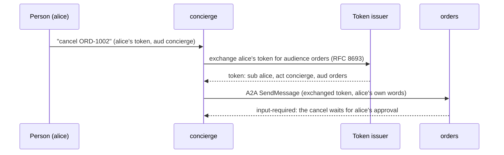

# Agents calling agents

<p class="gac-lede">An agent can ask other agents for the user it serves, over A2A. Each agent
knows the user and the agent in between, a person's approvals stay with that person, and one
command declares each agent another one asks.</p>

This page walks through the whole setup and links to the pages that hold each part in detail.
Nothing here is on by default: an agent built from the template serves A2A, but it asks no
other agent until you declare one, and under `jwt` it refuses every agent that calls it until
you list that agent.

## Who acts for whom

A person asks the concierge agent to cancel an order. The concierge asks the orders agent,
which owns the orders API. At the orders agent the request is still the person's, presented
by the concierge:

| Term | Meaning |
|---|---|
| subject | The person the request acts for (`Principal.id`, the token's `sub`). It never changes along the chain. |
| actor | The agent presenting the request for the subject (`Principal.actor`, the RFC 8693 `act` claim); nested `act` values are the agents before it. |
| direct, delegated | A request with no actor (the person asked this agent), or with one (an agent asked for the person). |
| peer | An agent this one asks: an API in `api-policy.yaml` with `protocol: a2a`. |
| relayer | An agent that carries the person's decision to a peer's pending approval. |



At the orders agent the request reaches only what the concierge started for alice, holds
none of alice's roles unless `AUTH_DELEGATED_ROLES` lends them, and never decides an approval
on alice's behalf. Alice, calling orders directly, owns everything done for her there. The
rules are in [Authentication](authentication.md#agents-calling-agents).

## Walk through: one agent asks another

Two projects, `concierge-agent` (it asks) and `orders-agent` (it is asked), both with the
`jwt` auth policy against one identity provider.

1. **Both run the 0.3 runtime.** A project created before 0.3 needs `graph-agents-cli scaffold
   upgrade` first: `peer add` refuses a 0.2 runtime. See [Upgrading projects](upgrading.md).
2. **Declare the peer in the concierge.** Show the diff, then write it:

    ```bash
    cd concierge-agent
    graph-agents-cli peer add orders \
      --description "Orders agent: lists and reads the caller's orders; cancels one after approval." \
      --dry-run
    graph-agents-cli peer add orders \
      --description "Orders agent: lists and reads the caller's orders; cancels one after approval."
    ```

    It writes the `orders_agent` API (`protocol: a2a`, the endpoint `/a2a/orders`, `auth:
    exchange` for audience `orders`, the calls the concierge may send, a gate on messages that
    approve orders' pending approvals, limits for an agent that runs a model), the manifest's
    `secrets.keys`, `.env.example` and the chart values, and regenerates
    `app/tools/a2a_peers.py`, which gives the model `ask_agent` and `approve_agent_action`.
    Never edit that module, and never hand-write an A2A client: see
    [Declare the agents it asks](api-policy.md#declare-the-agents-it-asks-graph-agents-cli-peer)
    and [Ask other agents](api-policy.md#ask-other-agents-app_utilsa2a_clientpy).
3. **Configure the concierge.** In its `.env` (and per environment in the chart values and the
   Secret): `ORDERS_AGENT_URL`, `TOKEN_EXCHANGE_URL`, `TOKEN_EXCHANGE_CLIENT_ID`,
   `TOKEN_EXCHANGE_CLIENT_SECRET`, and `PRINCIPAL_HASH_SALT`, which keys the conversation ids
   it sends to peers. `peer add` prints this list, with the settings on the peer.
4. **Let the issuer exchange.** The concierge's client may exchange users' tokens for audience
   `orders`, and exchanged tokens name the concierge in `act`. What the issuer must guarantee,
   and a Keycloak recipe: [Calling another agent for the user](authentication.md#calling-another-agent-for-the-user)
   and [Token exchange with Keycloak](authentication.md#token-exchange-with-keycloak).
5. **Admit the concierge at orders.** In orders' settings: `AUTH_JWT_AUDIENCE=orders` and
   `AUTH_ALLOWED_ACTORS=concierge`. Until then orders refuses the concierge with 403. Check it
   locally with a delegated dev token:

    ```bash
    cd orders-agent
    export GRAPH_AGENTS_CLI_API_KEY="$(graph-agents-cli auth dev-token --sub alice --act concierge)"
    graph-agents-cli run "list my orders"
    ```

6. **Decide how orders' gates are decided.** A gate at orders decides `direct` by default:
   alice approves the cancel at orders, with her own credentials, and the concierge's
   `ask_agent` reports `needs_direct_approval`. For the concierge to relay alice's decision,
   orders' owners loosen the gate, as a reviewed change:

    ```bash
    graph-agents-cli api approval orders_api --decide-with relayed --relayers concierge --dry-run
    ```

7. **Check both sides.** In the concierge, `graph-agents-cli lint` (it fails while
   `tools/a2a_peers.py` and the policy differ) and `graph-agents-cli peer show orders --check`
   (it reads orders' agent card without a credential and checks that it names the endpoint the
   concierge calls).
8. **Evaluate at the entry agent.** With orders running, run `graph-agents-cli eval run --url
   <the concierge's URL>` from the concierge. A case that reaches the relay decides it like any
   approval. A relay has no `operation_id`, so its `match` names the relay's API, method and
   path:
   `{"api": "orders_agent", "method": "POST", "path": "/a2a/orders"}`.
   The gate `peer add` writes holds only the messages that approve, so this match names the
   relay and no other call. See [Evaluation](evaluation.md#cases-that-reach-an-approval-gate).

Restart a running agent after `peer add`, `peer remove` or `peer sync`
([KI-156](../reference/known-issues.md#ki-156-a-running-agent-needs-a-restart-after-peer-add-or-peer-remove)).

## Relayed approvals

An agent relays a person's decision; it never makes one. The chain that holds this:

1. **The caller's own gate.** A `protocol: a2a` API that can send messages must gate or deny
   `a2a_operation: approve`, read from the message body, never from a tool's label. The
   concierge's run pauses, and alice approves the relay at the concierge.
2. **What she sees.** The approval shows the call that will actually happen first (`effect`),
   read from orders' own record of what it waits for, never from the model:

    ```text
      effect:      orders will POST /orders/ORD-1002/cancel (cancelOrder), as reported by orders
        body:      {
                     "reason": "customer request"
                   }
        expires:   2026-09-29T10:15:00+00:00 (at orders)
      via:         orders approval de2e5f10-3b1c-4c9a-a1f0-6e2d7c8b9a01 (decided there: relayed)
      call:        POST /a2a/orders (api orders_agent)
      ...
    ```

3. **The callee's checks.** Orders accepts the relayed decision only from a listed relayer,
   on a thread that agent started for alice, naming the approval's `digest` (the call exactly
   as shown); anything else is 403 `approval_direct_only`, 403 `not_an_approver` or 409
   `approval_digest_mismatch`, and the decision is recorded with `decided_via`.
4. **A rejection** is sent to orders at once, ungated, so its task ends.

Details: [Human approval](approvals.md#agents-calling-agents) and
[What the person sees](approvals.md#what-the-person-sees-when-their-agent-relays-a-decision).
A2A tasks that wait on an approval end as the approval does, whichever way it is decided
([HTTP API](../reference/http-api.md#a2a)).

## The user's own words

A calling agent may forward the person's own words with its request (the origin extension,
declared on the called agent's card). The called agent then checks the record ids a write
tool acts on against those words (`require_user_mentioned`, under
`A2A_DELEGATED_MENTIONS=origin`, the default), so an instruction planted in data the calling
agent read cannot pick the record. The run an approval resumes checks the words of the
request that paused it, which the approval keeps (never shown, dropped once decided), not the
words a relayed decision carries.

The origin guards against an injected model, not a compromised agent: the called agent trusts
the calling agent's code to forward the words faithfully. `A2A_FORWARD_ORIGIN=off` stops an
agent from sending them. See [When another agent asks for the user](api-policy.md#when-another-agent-asks-for-the-user).

## Many projects: the system view

When several of your projects call each other, an optional `graph-agents-system.yaml` names
them, the agents each calls, the issuer and the environments, and `graph-agents-cli system`
works on all of them at once:

```bash
graph-agents-cli system apply --dry-run      # both sides of every edge, one diff per project
graph-agents-cli system apply
graph-agents-cli system check --env dev      # SC01-SC13; exit 1 on an error
graph-agents-cli system delegations          # what each client may exchange for, for the issuer's admin
graph-agents-cli system deploy --env dev     # the agents called first, 3 at a time
graph-agents-cli system graph                # mermaid, dot or json
```

`system apply` writes what `peer add` writes in each caller, plus per environment the URLs
the callers dial, the called agents' `appUrl` (which their cards advertise), their audience
and allowed actors, and NetworkPolicy rules between the agents' pods. It never writes approval
gates (it prints the `api approval ... --decide-with relayed` line a relay needs, for the
called agent's owners), secrets or `.env`. See
[Many agents at once](api-policy.md#many-agents-at-once-graph-agents-systemyaml) and
[Deploy a system of agents](deploy.md#deploy-a-system-of-agents).

## Follow one request across agents

A request that crosses agents keeps one `X-Request-ID` and, under OTLP tracing, one trace:
calls to other agents carry the request id and the W3C trace context
(`PROPAGATE_TRACE_HEADERS=peers`, the default), and an agent continues an incoming trace on
its A2A routes only. Log records of a delegated run carry `actor`, the calling agent's id, and
run records and trace metadata name it too. `agent_token_exchanges_total` counts each
exchange by API and outcome. See
[Across agents and services](observability.md#across-agents-and-services).

## Sizing

- **Replicas share A2A tasks only on Postgres.** Under `CHECKPOINTER=postgres` every replica
  sees every task; a called agent with several replicas and in-memory tasks is an error of
  `system check` (SC06).
- **A shared database** needs `max_connections` for every agent: replicas × (`DB_POOL_MAX_SIZE`
  + 1) each, the extra connection holding the run leases (see
  [External database](deploy.md#external-database)). Put `database.max_connections` in the
  system file for SC10, which counts each pool but not the lease connection
  ([KI-164](../reference/known-issues.md#ki-164-sc10-leaves-out-each-replicas-run-lease-connection-and-its-hint-names-pgbouncer-without-its-mode)).
  Above about 120 connections, give agents their own databases or put a session-mode
  PgBouncer in front; a transaction-mode one is not supported.
- **Measured in the A2A experiment** (agents built with 0.2, on one kind node with
  7.65 GiB): at the chart's default requests, 18 agents with a bundled Postgres each fit;
  idle, an agent used
  about 108 MiB and its Postgres about 39 MiB. Under load the per-agent Postgres instances
  were the limit (run leases lost, readiness checks timing out), not CPU.
- **Deploys:** `system deploy` runs 3 at a time by default: seven images built and loaded at
  once made one agent take 158 s instead of 27-38 s.
- **The model's roster:** `ask_agent` lists every peer and its description; `lint` warns above
  40 peers.

## Threat model

| Threat | Control | What remains |
|---|---|---|
| An agent decides the person's approval | `decide_with: direct` by default; `relayed` needs a listed relayer, the thread's own agent and the digest | A compromised, listed relayer can deliver decisions: keep `direct` for high-risk gates |
| One agent reads or cancels another agent's tasks for the same user | Tasks, threads and approvals are owned by the subject and the actor | None known |
| An agent carries the user's roles into privileged checks | Delegated principals keep only `AUTH_DELEGATED_ROLES`, and never read across, administer or decide as a `role:` approver | A role an operator lends |
| Agent text passed off as the user's request | The actor reaches tools and the model (fenced request, a note); `require_user_mentioned` checks the forwarded words | A compromised calling agent can forge the words |
| A token replayed at another agent | A token per audience, minted just before the call, kept in memory only, at most 300 s; `forward_audience` for forwarded tokens; https to peers outside dev | Usable at its own audience until it expires |
| A hung issuer slows every request | Exchange never runs while a request is authenticated; 2 s timeout, one exchange for concurrent calls, a circuit breaker | Calls to peers fail during an outage |
| A card or reply steers the model | Descriptions capped, replies capped and fenced as tool output, the card's URL never dialed | Persuasion within the gates |
| Loops and deep chains | Calls up the chain refused; `AUTH_MAX_DELEGATION_DEPTH` (3) | Loop detection by name ([KI-147](../reference/known-issues.md#ki-147-the-callers-delegation-loop-check-knows-agents-by-name-only)) |
| An issuer that names no actor | The caller refuses such tokens unless the API opts in with `exchange.allow_actorless` | At a called agent's defaults, such a token reads as the user's own ([KI-149](../reference/known-issues.md#ki-149-a-called-agent-at-its-defaults-reads-an-exchanged-token-that-names-no-actor-as-the-users-own)) |

The issuer's own guarantees (which audiences each client may exchange for, `act` in exchanged
tokens, short lifetimes) are outside what the agents can enforce: `system delegations` prints
them for the issuer's admin.

## Limits

- `shared-bearer` has one principal and no actor: any holder of `API_KEY`, another agent
  included, decides requester gates. Use `jwt` or `custom` when agents call each other.
- Under `langgraph-server` no user credential reaches tools, so `auth: exchange` and
  `auth: forward` are refused: such an agent asks peers with `auth: bearer` only.
- `role:` gates are decided over HTTP, not over A2A.
- A running A2A task's subscription and cancel work only on the replica running it
  ([KI-024](../reference/known-issues.md#ki-024-a-running-a2a-tasks-subscription-and-cancel-work-only-on-the-replica-running-it)).
- A relayed approval whose peer answers `thread_busy` must be approved again
  ([KI-150](../reference/known-issues.md#ki-150-a-relayed-approval-whose-peer-answers-thread_busy-must-be-approved-again)).
- A relaying agent keeps the user's words in its stored A2A task
  ([KI-152](../reference/known-issues.md#ki-152-an-agent-that-relays-an-approval-keeps-the-users-words-in-its-stored-a2a-task)).
- The agent card lists one generic skill and needs a credential to read
  ([KI-120](../reference/known-issues.md#ki-120-the-agent-card-lists-one-generic-skill-and-reading-it-needs-a-credential)),
  and replies carry every model turn's text
  ([KI-119](../reference/known-issues.md#ki-119-a2a-replies-carry-every-model-turns-text-joined-with-no-separator)).
- Some models ask the user to confirm in text instead of calling the tool, which between
  agents turns an approval into a question
  ([KI-059](../reference/known-issues.md#ki-059-the-default-prompts-approval-paragraph-can-make-a-model-ask-instead-of-acting)).

## Next steps

<div class="grid cards" markdown>

-   :material-account-key-outline:{ .lg } **[Authentication](authentication.md#agents-calling-agents)**

    Subject and actor, the allow list, delegated roles, token exchange and the issuer.

-   :material-shield-check-outline:{ .lg } **[Outbound API policy](api-policy.md#other-agents-and-json-rpc-apis-protocol)**

    `protocol: a2a`, `peer add`, the system file and the A2A client.

-   :material-account-check-outline:{ .lg } **[Human approval](approvals.md#agents-calling-agents)**

    Who decides, relays, and what the person sees.

-   :material-kubernetes:{ .lg } **[Deploy to Kubernetes](deploy.md#deploy-a-system-of-agents)**

    `system deploy`, the agents' URLs and the NetworkPolicy between them.

</div>
